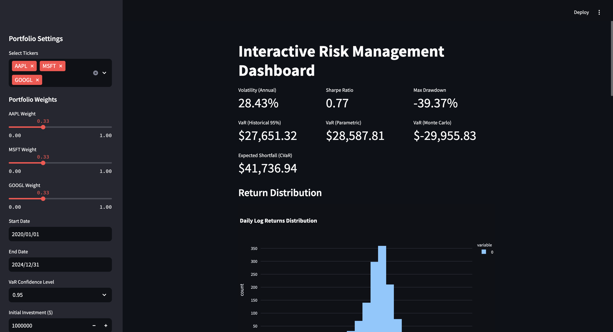
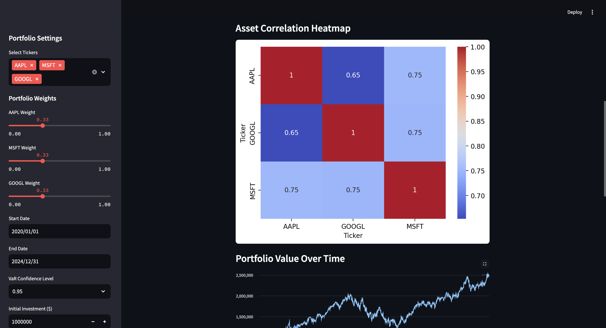
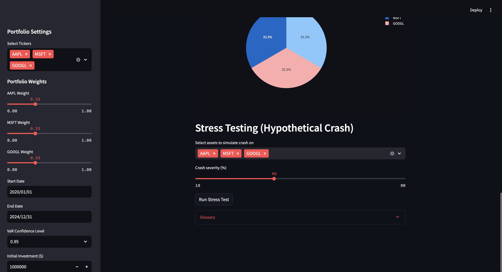

# MarketPulse: Real-Time Portfolio Risk Management Dashboard

An interactive risk management dashboard built using **Streamlit** to help users — from beginners to professionals — visualize, analyze, and understand portfolio risk with real-time market data.

---

##  Overview

This dashboard simulates a real-world investment portfolio risk management system. It allows users to:
- Select stock tickers
- Allocate weights
- Set timeframes and confidence levels
- Monitor key risk indicators like volatility, Value at Risk (VaR), and drawdowns
- Simulate market crash scenarios interactively

Whether you're a student, analyst, or investor, this tool helps you move from **guessing risk** to **measuring it intelligently**.


---

## Dashboard Preview






## Features

### Risk Metrics
- **Volatility** (Annualized)
- **Sharpe Ratio**
- **Max Drawdown**
- **Value at Risk (VaR)** – Historical, Parametric, Monte Carlo
- **Conditional VaR (CVaR)** – Expected Shortfall in worst-case scenarios

### Visualizations
- Return distribution histogram
- Correlation heatmap
- Portfolio growth over time
- Asset allocation pie chart

### Stress Testing
- Choose specific stocks
- Simulate % drops (10%–90%)
- Estimate and visualize potential losses

### Beginner-Friendly
- Warnings for incorrect inputs (e.g., weights not summing to 1)
- Glossary panel for financial concepts
- Tooltips and contextual insights

---

## Technologies Used

- **Python 3.12.10+**
- **Streamlit** – UI and interaction
- **Pandas / NumPy** – Financial data calculations
- **Plotly / Seaborn / Matplotlib** – Rich data visualizations
- **SciPy** – Statistical modeling

---

## Project Structure

```
risk_dashboard/
├── app.py                      # Main Streamlit app
├── Risk_monitor_Dashboard.py   # Metric Calculation
├── data/                       # (Optional) saved data files
├── plots/                      # (Optional) saved figures
└── README.md                   # Project documentation
```

---

## Getting Started

### Install Requirements

```bash
pip install streamlit yfinance pandas numpy plotly matplotlib seaborn scipy
```

### Run the Dashboard

```bash
streamlit run app.py
```

The app will launch in your browser at `http://localhost:8501`.

---

## Glossary

| Term          | Description |
|---------------|-------------|
| **Volatility** | How much asset prices move up/down over time |
| **Sharpe Ratio** | Return earned per unit of risk |
| **VaR** | Value at Risk: worst expected loss over a time frame with a confidence level |
| **CVaR** | Expected average loss in the worst 5% of cases |
| **Drawdown** | Largest drop from peak to bottom |
| **Stress Test** | Simulate extreme losses from market crashes |

---


